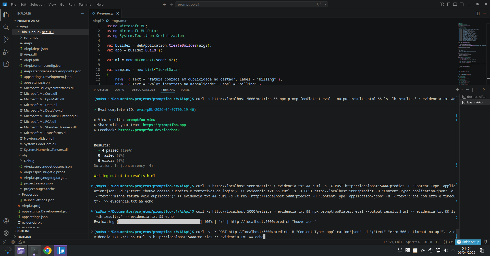

promptfoo c# ml

Este projeto demonstra um pipeline completo de avaliação de machine learning executado localmente, combinando um backend em C# com ML.NET e validação automatizada utilizando Promptfoo. O sistema classifica entradas de texto em categorias específicas e valida o comportamento do modelo através de testes estruturados.

objetivo

O objetivo é simular um serviço real de machine learning com avaliação automatizada, garantindo reprodutibilidade, consistência e validação de resultados. O foco está na integração entre backend, modelo de classificação e testes automatizados.

arquitetura

O sistema é composto por três componentes principais:

API ASP.NET Core responsável pelo backend
Modelo de machine learning utilizando ML.NET
Promptfoo como engine de avaliação e validação

Fluxo:
entrada do usuário -> API C# -> modelo ML -> predição -> avaliação com Promptfoo -> geração de relatório

stack utilizada
C#
ASP.NET Core
ML.NET
Promptfoo CLI
Bash para automação de testes
funcionalidades
Classificação de texto em categorias: billing, account, technical, security
Cálculo de confiança da predição
Endpoints REST para predição e métricas
Avaliação automatizada com Promptfoo
Geração de evidência com timestamp
Exportação de resultados em HTML, JSON e CSV
Execução reprodutível de testes
endpoints

GET /metrics
Retorna métricas do modelo como acurácia e log loss

POST /predict
Exemplo de requisição:
{
"text": "entrada do usuário"
}

Exemplo de resposta:
{
"category": "categoria prevista",
"confidence": 0.98,
"answer": "explicação da classificação"
}

execução de testes

O sistema foi validado utilizando Promptfoo com múltiplos cenários cobrindo diferentes categorias.

Resultados obtidos:

billing classificado corretamente
account classificado corretamente
technical classificado corretamente
security classificado corretamente

Resumo:
4 testes executados
4 aprovados
0 falhas
0 erros

evidências

Durante a execução foram gerados:

logs estruturados com timestamp
resultados em formato CSV
tabelas formatadas no terminal
validação automática com asserts

As evidências garantem rastreabilidade e reprodutibilidade dos testes.

como executar
restaurar dependências
dotnet restore
iniciar a API
dotnet run
executar avaliação
npx promptfoo@latest eval
gerar relatórios
npx promptfoo@latest eval --output results.html
npx promptfoo@latest eval --output results.json
npx promptfoo@latest eval --output results.csv
fluxo de validação

O processo de validação inclui:

envio de entradas para o modelo
classificação automática
validação por regras (asserts)
geração de relatórios
registro de execução
resultados principais
100 por cento de sucesso nos testes
classificação consistente entre categorias
alta confiança nas predições
pipeline totalmente reproduzível
conclusão

Este projeto demonstra uma implementação prática de um backend com machine learning integrado a um sistema de avaliação automatizado. O resultado vai além de uma API simples, incluindo validação, evidência e reprodutibilidade, características fundamentais em sistemas reais de IA.

observações

O projeto é totalmente executado localmente e não depende de serviços em nuvem.
